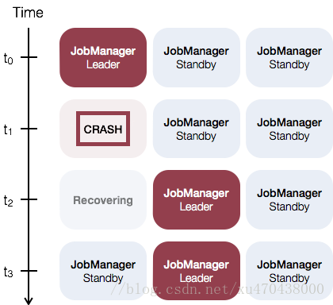

## Flink集群部署方式

### Local模式

### Standalone cluster

#### 高可用

> Standalone模式（独立模式）下JobManager的高可用性的基本思想是，任何时候都有一个 Master JobManager ，并且多个Standby JobManagers 。 Standby JobManagers可以在Master JobManager 挂掉的情况下接管集群成为Master JobManager。 这样保证了没有单点故障，一旦某一个Standby JobManager接管集群，程序就可以继续运行。 Standby JobManager和Master JobManager实例之间没有明确区别。 每个JobManager都可以成为Master或Standby节点。

配置：

要启用JobManager高可用性，必须将高可用性模式设置为zookeeper， 配置一个ZooKeeper quorum，并配置一个masters文件 存储所有JobManager hostname 及其Web UI端口号。

Flink利用ZooKeeper 实现运行中的JobManager节点之间的分布式协调。 ZooKeeper是独立于Flink的服务，它通过领导选举制和轻量级状态一致性存储来提供高度可靠的分布式协调。

### Flink on Yarn

#### 高可用

在运行高可用性的YARN群集时，**我们不会运行多个JobManager（ApplicationMaster）实例**，而只会运行一个**实例**，当**实例发生**故障时，它将由YARN重新启动。确切的行为取决于您使用的特定YARN版本。

### 额外

> 当Flink系统启动时，首先启动JobManager和一至多个TaskManager。JobManager负责协调Flink系统，TaskManager则是执行并行程序的worker。当系统以本地形式启动时，一个JobManager和一个TaskManager会启动在同一个JVM中。
>  当一个程序被提交后，系统会创建一个Client来进行预处理，将程序转变成一个并行数据流的形式，交给JobManager和TaskManager执行。

> Flink运行时主要角色有两个：JobManager和TaskManager，无论是standalone集群，flink on yarn都是要启动这两个角色。JobManager主要是负责接受客户端的job，调度job，协调checkpoint等。TaskManager执行具体的Task。TaskManager为了对资源进行隔离和增加允许的task数，引入了slot的概念，这个slot对资源的隔离仅仅是对内存进行隔离，策略是均分，比如taskmanager的管理内存是3GB，假如有两个个slot，那么每个slot就仅仅有1.5GB内存可用。Client这个角色主要是为job提交做些准备工作，比如构建jobgraph提交到jobmanager，提交完了可以立即退出，当然也可以用client来监控进度。
>
> Jobmanager和TaskManager之间通信类似于Spark 的早期版本，采用的是actor系统。
>
> 

